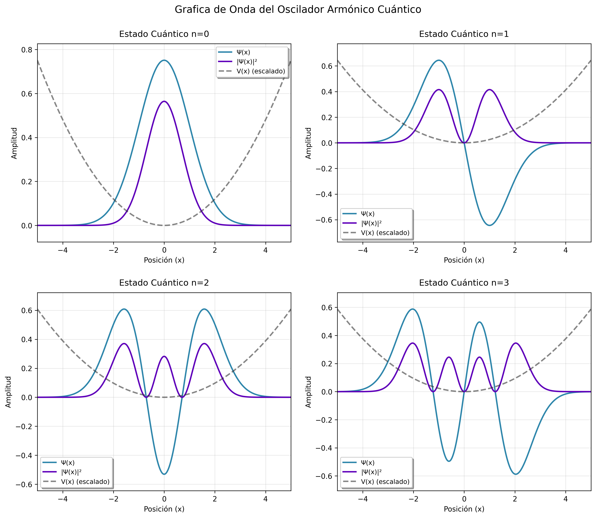

# Proyecto Ocilador Armónico Cuántico

## Palabras Claves
Python, Bash, Makefile, c, Algoritmo-Numerov

# Método de Numerov
El método de Numerov es una técnica numérica utilizada para resolver ecuaciones diferenciales de segundo orden, como la ecuación de Schrödinger, que se presenta comúnmente en la física cuántica. Este algoritmo se aplica especialmente cuando no es posible obtener una solución analítica directa, y se utiliza para calcular las funciones propias y los valores propios en sistemas cuánticos unidimensionales. El objetivo principal del método es proporcionar una aproximación precisa y eficiente de la solución de la ecuación de Schrödinger, especialmente en casos donde las soluciones exactas no son accesibles debido a la complejidad del potencial o las condiciones del sistema.

$$
\frac{d^{2}\psi}{dx^{2}} = - \frac{2m}{\hbar}\left(E-\frac{1}{2}Kx^{2}\right)\psi(x)
$$

**Donde:**
- $K$ es la constante de fuerza.
- Siendo la fuerza sobre la masa $F = -Kx$, proporcional al desplazamiento $x$ y dirigida hacia
el origen.

Este método mejora la precisión en comparación con otros métodos numéricos al usar una fórmula de integración de paso fijo, lo que lo hace adecuado para problemas cuánticos en los que se desea obtener tanto las funciones propias como los valores de energía discretos de un sistema. Al aplicar este algoritmo, se pueden resolver problemas como el oscilador armónico cuántico, permitiendo la determinación numérica de las energías cuantizadas y sus correspondientes funciones de onda.

Si estás interesado en profundizar más sobre este método, te recomiendo leer el siguiente artículo: [Oscilador Armónico Cuántico](https://gitlab.com/diegorestrepo/sistemas_operativos/-/blob/main/Documentos/oscilador_armonico_cuantico.md?ref_type=heads), donde encontrarás una explicación detallada y una implementación del método de Numerov para resolver el Oscilador Armónico Cuántico.
Por otro lado, Si deseas ver un video explicativo sobre el método de Numerov para resolver el Oscilador Armónico Cuántico, puedes acceder al siguiente enlace: [Ver Video en YouTube](https://www.youtube.com/watch?v=QnUe9UwLV6I).

<br>

# Resultados
En los resultados se logró obtener la gráfica con sus cuatro estados, como se muestra en la Figura 1.

_La Figura 1 muestra la representación de los cuatro estados del oscilador armónico cuántico, destacando las funciones de onda correspondientes a cada nivel de energía. Cada estado refleja la probabilidad de encontrar la partícula en diferentes posiciones dentro del potencial._

<br>

1. Requisitos previos:
 
   ```bash
   - Compilador C (gcc)
   - Python 3.x
   - Make
   ```
 
2. Clonar el repositorio:
 
   ```bash
   git clone [https://github.com/JoseL0pez/Numerov.git]
   ```
 
3. Compilar y ejecutar:
   ```bash
   make all
   ```

<br>

## Estructura del código
 
```
.
├── proyectoNumerov.c  # Implementación del método de Numerov
├── graficos.py        # Visualización de resultados
├── Makefile           # Sistema de compilación
└── requirements.txt   # Dependencias de Python
```
